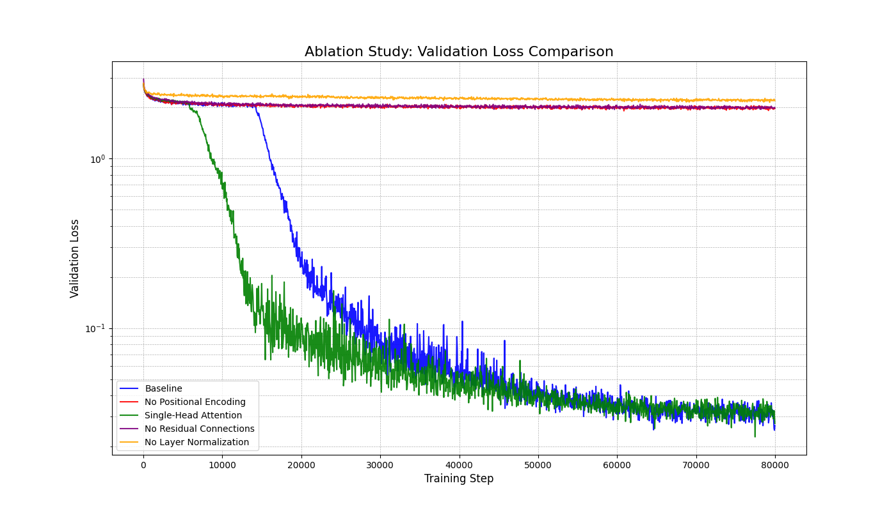

# Transformer from Scratch for Language Modeling

This project is a from-scratch implementation of an Encoder-only Transformer model in PyTorch, as described in the paper "Attention Is All You Need" by Vaswani et al. (2017).

The primary goal is to build a deep understanding of the Transformer architecture by implementing its core components, including:
- Multi-Head Self-Attention
- Position-wise Feed-Forward Networks
- Residual Connections and Layer Normalization
- Sinusoidal Positional Encoding

The model is trained on the `Tiny Shakespeare` dataset for a character-level language modeling task. The project also includes a comprehensive set of ablation studies to analyze the contribution of each core component to the model's performance.

## Project Structure
```
.
├───data/
│   └───input.txt
├───results/
│   ├───baseline/
│   ├───ablation_no_pe/
│   │   ... (other experiment results)
│   └───ablation_comparison.png
├───scripts/
│   ├───run_ablations.sh
│   └───plot_ablation_results.py
├───src/
│   ├───attention.py
│   ├───model.py
│   └───... (other source files)
├───run_train.py
└───README.md
```

## Setup

1. Clone the repository:
   ```bash
   git clone https://github.com/Laxyyy/M502082B_midterm_25120390.git
   cd M502082B_midterm_25120390
   ```

2. Install the required dependencies:
   ```bash
   pip install -r requirements.txt
   ```

## Reproducing the Experiments

The main results from the report can be reproduced in two simple steps.

### Step 1: Run All Training Experiments

This single command will execute the baseline training and all four ablation studies sequentially. Each experiment's results (logs, checkpoints) will be saved to a separate directory inside `results/`.

```bash
bash scripts/run_ablations.sh
```
**Note:** This process involves training five models and will take a significant amount of time to complete.

### Step 2: Generate the Final Comparison Plot

After all training runs are complete, execute the following script. It will read the training logs from all experiment directories and generate the final comparison graph `ablation_comparison.png` in the `results/` directory.

```bash
python scripts/plot_ablation_results.py
```

## Ablation Study Results

The following plot shows the validation loss comparison between the baseline model and the four ablation experiments, demonstrating the importance of each core Transformer component.



## Advanced: Running a Single Custom Experiment

If you wish to run a single experiment with a custom configuration, you can use the `run_train.py` script directly with its command-line arguments.

```bash
python run_train.py [OPTIONS]
```

**Available Options:**

- `--results_dir <path>`: Directory to save results (default: `results`).
- `--num_heads <int>`: Number of attention heads (default: `4`).
- `--ablation_no_pe`: Flag to disable positional encoding.
- `--ablation_no_residual`: Flag to disable residual connections.
- `--ablation_no_layernorm`: Flag to disable layer normalization.

**Example:** Run a single-head attention model and save results to `results/my_experiment`.
```bash
python run_train.py --num_heads 1 --results_dir results/my_experiment
```